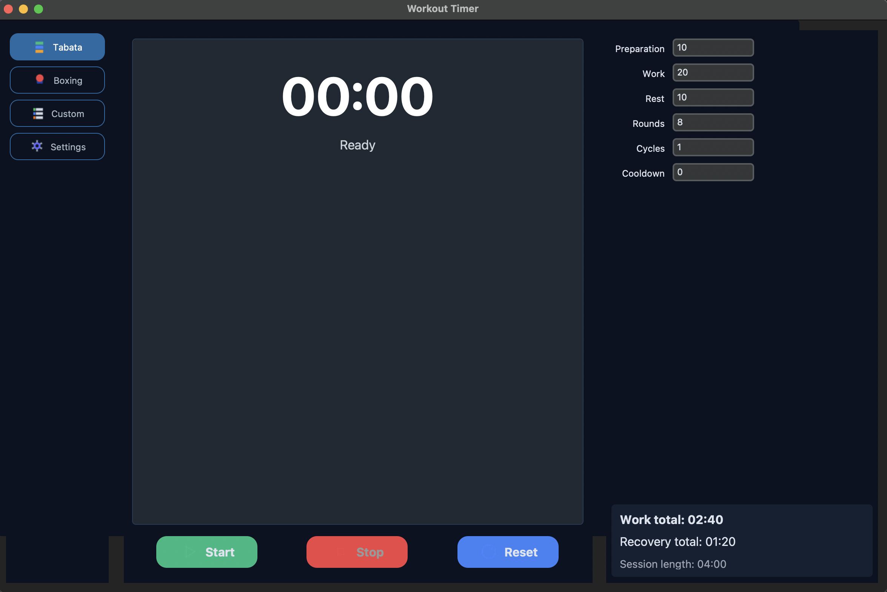
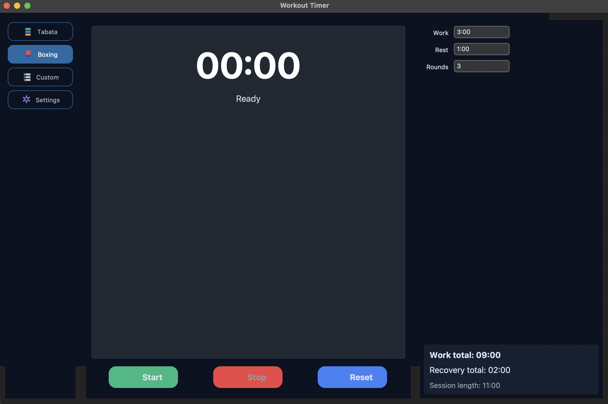
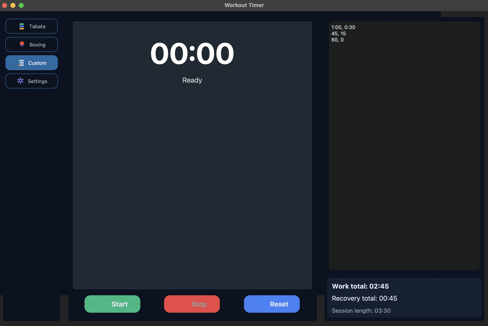
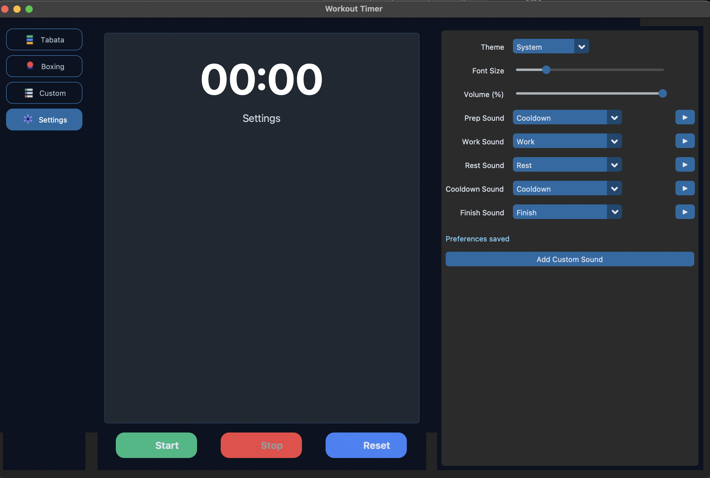

# Workout Timer


<div align="center">
  
  
</div>

<div align="center">
  
  
</div>

> **Quick tour**
>
> - **Sidebar navigation** sulla sinistra per passare tra Tabata, Boxing, Custom e Settings.
> - **Timer centrale** mostra fase corrente, colore e animazioni al cambio di segmento.
> - **Card riassuntiva** in basso a destra riepiloga il totale di lavoro/recupero e la durata della sessione.
> - **Control panel** Start/Stop/Reset sempre in vista, con icone e stati disabilitati quando opportuno.

Python application that delivers configurable workout timers via GUI and CLI. The interface now features live duration summaries, customizable notification sounds, and a responsive layout that stays readable as you tweak parameters. The CLI keeps the original console countdown for lightweight usage.

## Highlights

- Live work/rest totals that update instantly when you edit inputs in any mode.
- Sound notifications with volume control, preview, and automatic macOS fallback playback.
- Responsive CustomTkinter UI with dedicated tabs for modes and settings to keep the workflow tidy.

## User Experience

- **Modern dark theme** with teal accents, adaptive light/dark toggle, and scalable typography for better readability at any distance.
- **Sidebar navigation** that keeps Tabata, Boxing, Custom, and Settings one click away, highlighting the active workflow.
- **Phase-aware feedback**: background colors, subtle animations, and distinct sounds for prep/work/rest/cooldown/finish keep you on rhythm.
- **Session insights** popup summarises work vs recovery time, rounds completed, and lets you save the run to `history.json`.
- **Responsive layout** automatically stacks controls on narrow windows and spreads them on wide desktops for an uncluttered view.

## Requirements

Install dependencies from `requirements.txt` (Python 3.10+ recommended):

```bash
pip install -r requirements.txt
```

## GUI Modes

Run the GUI (default) to configure a session visually:

```bash
python3 main.py
```

### Tabata
- Configura preparation, work, rest, rounds, cycles e cooldown. Ogni campo accetta secondi, suffissi (`90s`, `2m`) o formato `mm:ss` (es. `1:30`).
- Il timer centrale cambia colore per fase e la card in basso (vedi immagine *Tabata mode*) tiene d’occhio lavoro, recupero e durata totale.
- Ideale per protocolli HIIT con cicli ripetuti; i round/cicli impostati vengono riportati anche nel riepilogo finale.

### Boxing
- Imposta i classici round da ring (default 3′ work / 1′ rest) o crea combinazioni personalizzate.
- L’interfaccia evidenzia l’attività corrente (Work/Rest) con badge colorati e aggiorna il totale di workload (screenshot *Boxing mode*).
- Il popup finale indica quante riprese sono state completate e quanto tempo complessivo è stato dedicato al recupero.

### Custom
- Costruisci una sequenza libera inserendo coppie `work, rest` nella textarea (una per linea), ad esempio:
  ```
  1:00, 0:30
  45, 15
  2m, 30s
  ```
- Ogni riga rappresenta una coppia lavoro/recupero (rest opzionale, default 0). L’app calcola subito totali e durata complessiva (screenshot *Custom mode*).
- Perfetto per superset o routine con pattern non ripetitivi; puoi salvare la sessione una volta conclusa.

Use **Start** to launch the selected program, **Stop** to pause, and **Reset** to return to `00:00`.

## Settings

- Scegli tema (Dark/Light/System) e scala i font con uno slider per rendere il timer leggibile anche da lontano.
- Associa suoni diversi a prep/work/rest/cooldown/finish selezionandoli dalla dropdown o caricando nuovi WAV (screenshot *Settings page*).
- Usa **Test Sound** per l’anteprima; se la riproduzione fallisce l’app utilizza automaticamente un beep di fallback.
- Le preferenze vengono salvate istantaneamente in `settings.json` e applicate alla GUI senza riavvii.

## CLI Usage

Retain the console countdown with the `--cli` flag:

```bash
python3 main.py --cli 45 --label Warmup
```

This prints the remaining time in the terminal, useful for scripted or quick runs or background automation.

## Configuration Files

- `settings.json` records the sound path and volume for notifications.
- `assets/beep.wav` provides the default beep bundled with the application.
- `history.json` keeps the optional saved summaries from completed sessions.
